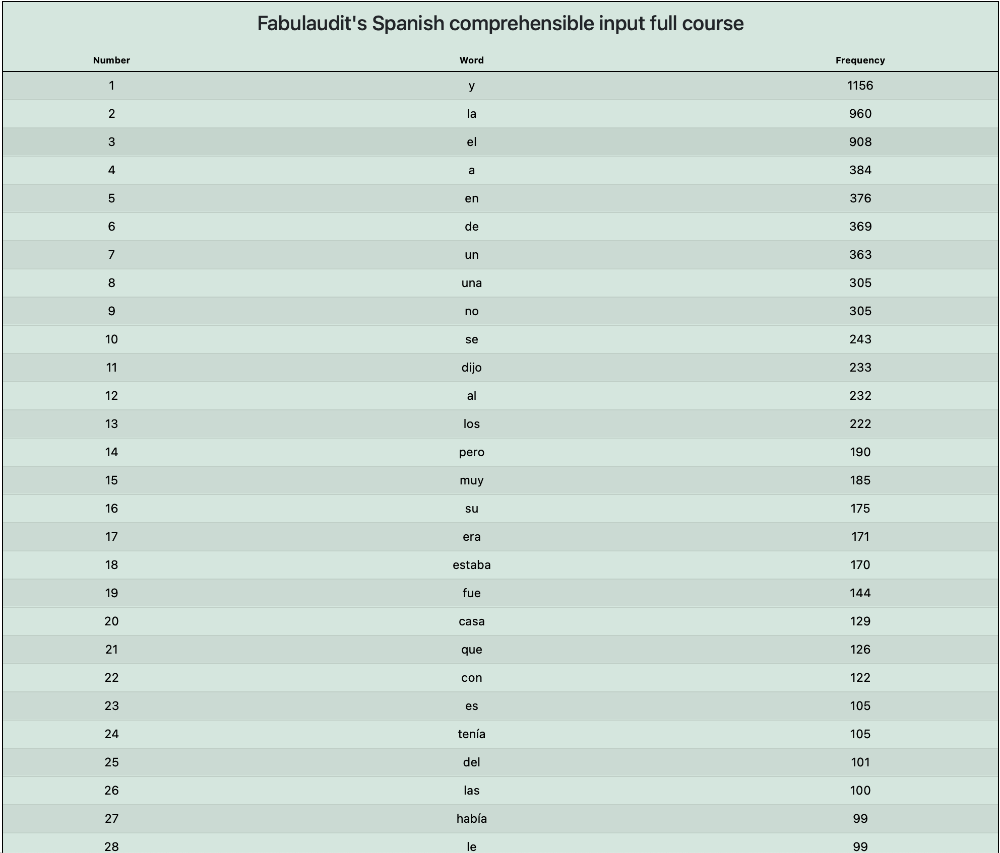

# spanishwordfrequency
I've been learning Spanish off and on for a lifetime now. One of the best resources I've found is Fabulaudit's video series on YouTube: [Spanish Comprehensible Input Course for Absolute Beginners!](https://youtu.be/8FmT4sIdZx0?si=45iIKNGb96NDy135)\


Fabulaudit not only created a fun and engaging story for Spanish learners, but he also provides a transcript for each video so you can read and follow along if you'd like!

If you're learning a foreign language, you'll find that some words are used more frequently than others. Like me, you might want to study those most frequently used words.

This project collects all the stories Fabulaudit made and ranks the most frequent words.



Want to see the list? check it out here: [word frequency list](word-frequencies.json)

## Installation

1. **Clone the repository:**
   ```bash
   git clone https://github.com/joelcook/spanishwordfrequency.git
   cd spanishwordfrequency

### Install dependencies:
`npm install`

### Run the application:

`npm start`

## Usage
Once the server is running, you can see the list here: `http://localhost:3000`.

## License

This project is licensed under the ISC License.